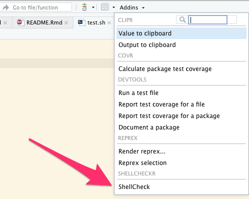

<!-- README.md is generated from README.Rmd. Please edit that file -->

# shellcheckr

<!-- badges: start -->

[](https://www.tidyverse.org/lifecycle/#experimental)
[](https://github.com/sambrightman/shellcheckr/actions)
<!-- badges: end -->

`shellcheckr` allows you to run
[`shellcheck`](https://www.shellcheck.net/) manually or as an
[addin](https://rstudio.github.io/rstudioaddins/) when editing shell
scripts in RStudio.

## Installation

You can install the released version of `shellcheckr` from
[CRAN](https://CRAN.R-project.org) with:

``` r
install.packages("shellcheckr")
```

**NOTE** you must have `shellcheck` in your `$PATH`.

## Example

Normally you would run `shellcheckr` from the *Addins-\>ShellCheck*
toolbar menu item:




*Tools-\>Modify Keyboard Shortcuts* on the main menu can be used to make
a keyboard shortcut for it. You can also call it manually:

``` r
library(shellcheckr)
shellcheckr('~/.bashrc') # raw JSON output
shellcheckrMarkers('~/.bashrc') # markers with wiki links
```
